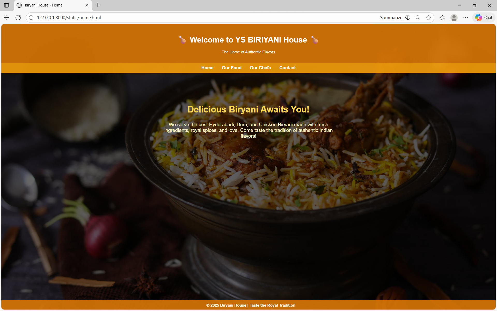
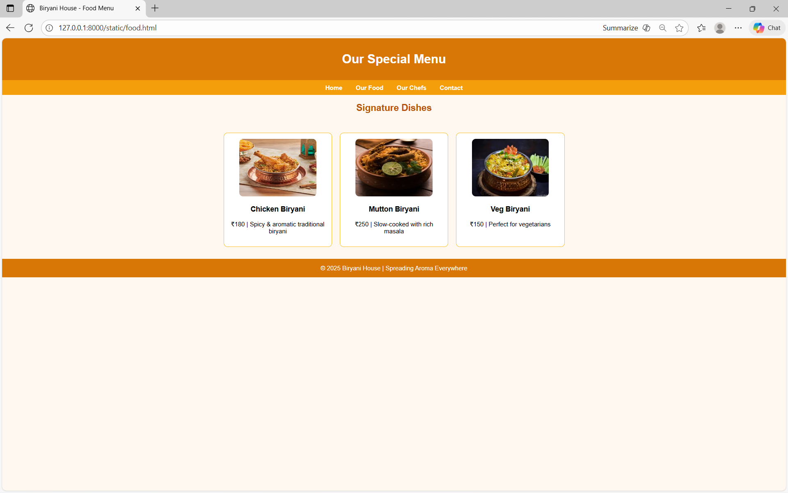
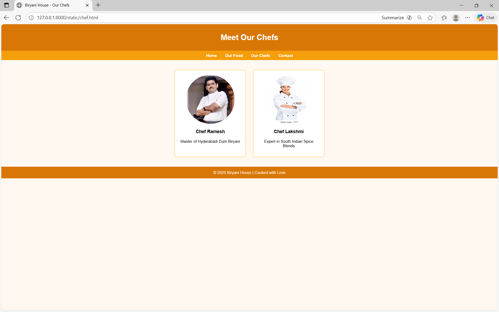
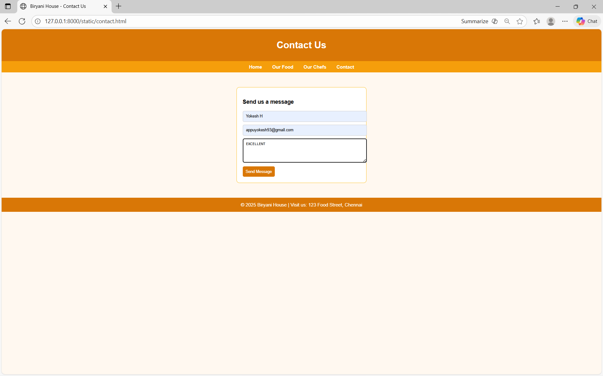

# Ex.07 Restuarant Website
## Date:

## AIM:
To develop a static Resturant website to display the menu and services provided by the resturant.

## DESIGN STEPS:

### Step 1:
Requirement collection.

### Step 2:
Creating the layout using HTML and CSS.

### Step 3:
Updating the sample content.

### Step 4:
Choose the appropriate style and color scheme.

### Step 5:
Validate the layout in various browsers.

### Step 6:
Validate the HTML code.

### Step 7:
Publish the website in the given URL.

## PROGRAM:
## DEVELOPED BY:YOKESH H
## REG NO:212224230312

## home.html
```
<!DOCTYPE html>
<html lang="en">
<head>
  <meta charset="UTF-8">
  <title>Biryani House - Home</title>
  <style>
    body {
      font-family: Arial, sans-serif;
      margin: 0;
      padding: 0;
      background-image: url('image.png'); /* 🔥 Your own image file here */
      background-size: cover;
      background-repeat: no-repeat;
      background-attachment: fixed;
      color: white;
    }

    .overlay {
      background-color: rgba(0, 0, 0, 0.6);
      min-height: 100vh;
    }

    header {
      background-color: rgba(217, 119, 6, 0.9);
      text-align: center;
      padding: 20px 0;
    }

    nav {
      background-color: rgba(245, 158, 11, 0.9);
      padding: 10px;
      text-align: center;
    }

    nav a {
      color: white;
      text-decoration: none;
      margin: 15px;
      font-weight: bold;
      font-size: 18px;
    }

    nav a:hover {
      text-decoration: underline;
    }

    section {
      text-align: center;
      padding: 100px 30px;
    }

    section h2 {
      font-size: 36px;
      color: #ffdb58;
    }

    section p {
      font-size: 20px;
      color: #fef9c3;
      max-width: 700px;
      margin: 20px auto;
    }

    footer {
      background-color: rgba(217, 119, 6, 0.9);
      text-align: center;
      padding: 10px;
      position: fixed;
      bottom: 0;
      width: 100%;
      color: white;
      font-weight: bold;
    }
  </style>
</head>
<body>
  <div class="overlay">
    <header>
      <h1>🍗 Welcome to YS BIRIYANI House 🍗</h1>
      <p>The Home of Authentic Flavors</p>
    </header>

    <nav>
      <a href="home.html">Home</a>
      <a href="food.html">Our Food</a>
      <a href="chef.html">Our Chefs</a>
      <a href="contact.html">Contact</a>
    </nav>

    <section>
      <h2>Delicious Biryani Awaits You!</h2>
      <p>We serve the best Hyderabadi, Dum, and Chicken Biryani made with fresh ingredients, royal spices, and love. Come taste the tradition of authentic Indian flavors!</p>
    </section>
    
    <footer>
      © 2025 Biryani House | Taste the Royal Tradition
    </footer>
  </div>
</body>
</html>

```

## food.html
```
<!DOCTYPE html>
<html lang="en">
<head>
  <meta charset="UTF-8">
  <title>Biryani House - Food Menu</title>
  <style>
    body { background-color: #fff8f0; font-family: Arial; margin: 0; }
    header, footer { background-color: #d97706; color: white; text-align: center; padding: 15px; }
    nav { background-color: #f59e0b; text-align: center; padding: 10px; }
    nav a { color: white; margin: 15px; text-decoration: none; font-weight: bold; }
    h2 { text-align: center; color: #b45309; }
    .menu {
      display: flex;
      justify-content: center;
      flex-wrap: wrap;
      gap: 20px;
      padding: 30px;
    }
    .item {
      background-color: #fff;
      border: 2px solid #fbbf24;
      border-radius: 10px;
      width: 250px;
      text-align: center;
      padding: 15px;
    }
    img { border-radius: 10px; width: 200px; height: 150px; }
  </style>
</head>
<body>
  <header><h1>Our Special Menu</h1></header>
  <nav>
    <a href="home.html">Home</a>
    <a href="food.html">Our Food</a>
    <a href="chef.html">Our Chefs</a>
    <a href="contact.html">Contact</a>
  </nav>
  
  <h2>Signature Dishes</h2>
  <div class="menu">
    <div class="item">
      
      <h3>Chicken Biryani</h3>
      <p>₹180 | Spicy & aromatic traditional biryani</p>
    </div>
    <div class="item">
      
      <h3>Mutton Biryani</h3>
      <p>₹250 | Slow-cooked with rich masala</p>
    </div>
    <div class="item">
      
      <h3>Veg Biryani</h3>
      <p>₹150 | Perfect for vegetarians</p>
    </div>
  </div>

  <footer>© 2025 Biryani House | Spreading Aroma Everywhere</footer>
</body>
</html>

```
## chef.html
```
<!DOCTYPE html>
<html lang="en">
<head>
  <meta charset="UTF-8">
  <title>Biryani House - Our Chefs</title>
  <style>
    body { background-color: #fff8f0; font-family: Arial; margin: 0; }
    header, footer { background-color: #d97706; color: white; text-align: center; padding: 15px; }
    nav { background-color: #f59e0b; text-align: center; padding: 10px; }
    nav a { color: white; margin: 15px; text-decoration: none; font-weight: bold; }
    .chefs {
      display: flex;
      justify-content: center;
      gap: 30px;
      flex-wrap: wrap;
      padding: 40px;
    }
    .chef {
      background-color: #fff;
      border: 2px solid #fbbf24;
      border-radius: 10px;
      width: 250px;
      text-align: center;
      padding: 20px;
    }
    img { width: 200px; height: 200px; border-radius: 50%; }
  </style>
</head>
<body>
  <header><h1>Meet Our Chefs</h1></header>
  <nav>
    <a href="home.html">Home</a>
    <a href="food.html">Our Food</a>
    <a href="chef.html">Our Chefs</a>
    <a href="contact.html">Contact</a>
  </nav>

  <div class="chefs">
    <div class="chef">
      
      <h3>Chef Ramesh</h3>
      <p>Master of Hyderabadi Dum Biryani</p>
    </div>
    <div class="chef">
      
      <h3>Chef Lakshmi</h3>
      <p>Expert in South Indian Spice Blends</p>
    </div>
  </div>

  <footer>© 2025 Biryani House | Cooked with Love</footer>
</body>
</html>

```
## contact.html
```
<!DOCTYPE html>
<html lang="en">
<head>
  <meta charset="UTF-8">
  <title>Biryani House - Contact Us</title>
  <style>
    body { background-color: #fff8f0; font-family: Arial; margin: 0; }
    header, footer { background-color: #d97706; color: white; text-align: center; padding: 15px; }
    nav { background-color: #f59e0b; text-align: center; padding: 10px; }
    nav a { color: white; margin: 15px; text-decoration: none; font-weight: bold; }
    form {
      background-color: #fff;
      max-width: 400px;
      margin: 50px auto;
      border: 2px solid #fbbf24;
      border-radius: 10px;
      padding: 20px;
    }
    input, textarea {
      width: 100%;
      margin-bottom: 10px;
      padding: 10px;
      border-radius: 5px;
      border: 1px solid #ccc;
    }
    button {
      background-color: #d97706;
      color: white;
      border: none;
      padding: 10px;
      border-radius: 5px;
      cursor: pointer;
    }
    button:hover { background-color: #b45309; }
  </style>
</head>
<body>
  <header><h1>Contact Us</h1></header>
  <nav>
    <a href="home.html">Home</a>
    <a href="food.html">Our Food</a>
    <a href="chef.html">Our Chefs</a>
    <a href="contact.html">Contact</a>
  </nav>

  <form>
    <h3>Send us a message</h3>
    <input type="text" placeholder="Your Name" required>
    <input type="email" placeholder="Your Email" required>
    <textarea placeholder="Your Message" rows="4" required></textarea>
    <button type="submit">Send Message</button>
  </form>

  <footer>© 2025 Biryani House | Visit us: 123 Food Street, Chennai</footer>
</body>
</html>

```
## OUTPUT:




## RESULT:
The program for designing software company website using HTML and CSS is completed successfully.
